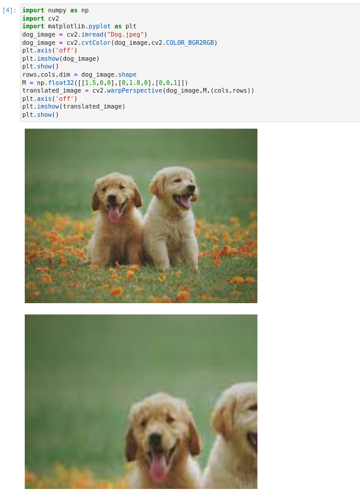
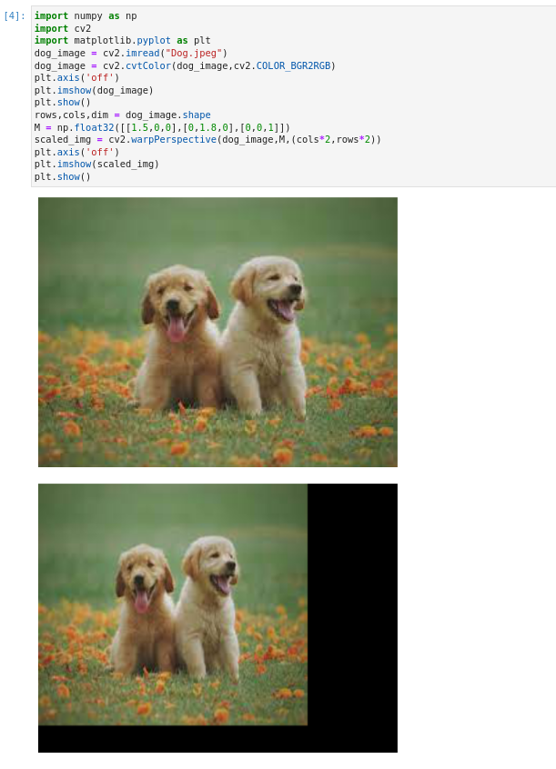
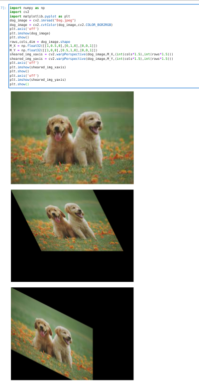
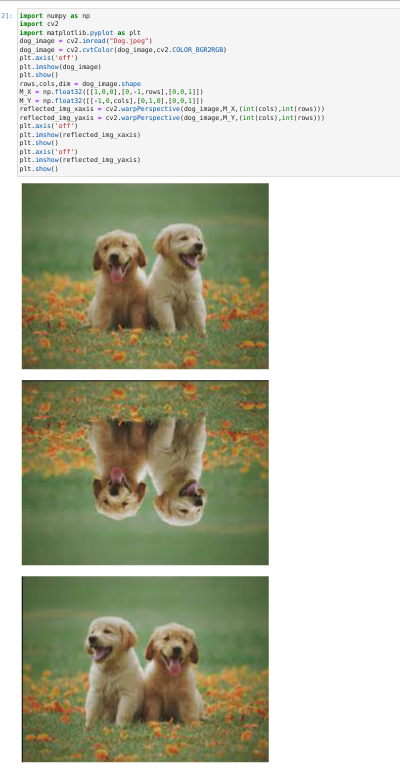
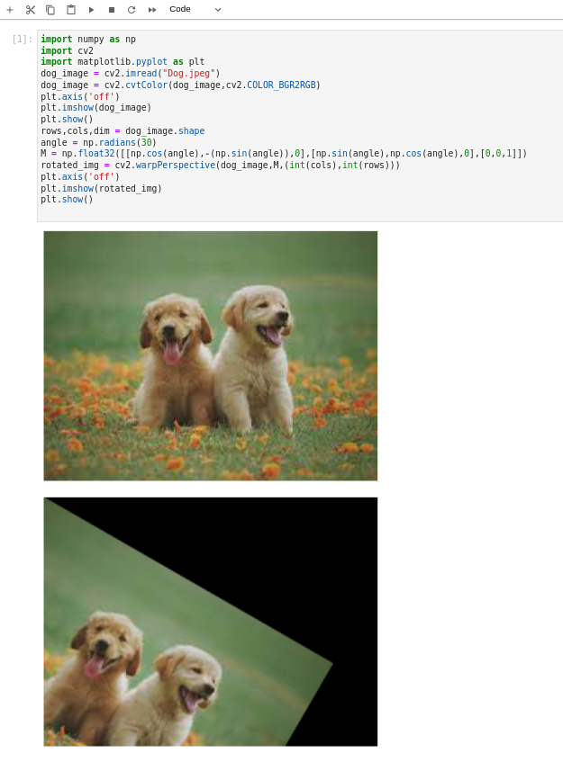
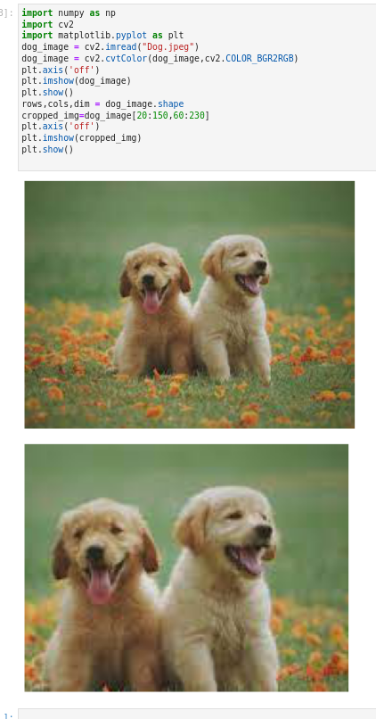

# Image-Transformation
## Aim
To perform image transformation such as Translation, Scaling, Shearing, Reflection, Rotation and Cropping using OpenCV and Python.

## Software Required:
Anaconda - Python 3.7

## Algorithm:
### Step1:
Import the necessary libraries and read the original image and save it as a image variable.
### Step2:
Translate the image using M=np.float32([[1,0,20],[0,1,50],[0,0,1]]) translated_img=cv2.warpPerspective(input_img,M,(cols,rows))

### Step3:
Scale the image using M=np.float32([[1.5,0,0],[0,2,0],[0,0,1]]) scaled_img=cv2.warpPerspective(input_img,M,(cols,rows))

### Step4:
Shear the image using M_x=np.float32([[1,0.2,0],[0,1,0],[0,0,1]]) sheared_img_xaxis=cv2.warpPerspective(input_img,M_x,(cols,rows))

### Step5:
Reflection of image can be achieved through the code M_x=np.float32([[1,0,0],[0,-1,rows],[0,0,1]]) reflected_img_xaxis=cv2.warpPerspective(input_img,M_x,(cols,rows))

### step6:
Rotate the image using angle=np.radians(45) M=np.float32([[np.cos(angle),-(np.sin(angle)),0],[np.sin(angle),np.cos(angle),0],[0,0,1]]) rotated_img=cv2.warpPerspective(input_img,M,(cols,rows))

### Step7:
Crop the image using cropped_img=input_img[20:150,60:230]

### Step8:
Display all the Transformed images.


## Program:
```python
### Developed By: Gumma Dileep kumar
### Register Number: 212222240032
```
### i)Image Translation
```python
import numpy as np
import cv2
import matplotlib.pyplot as plt
dog_image = cv2.imread("Dog.jpeg")
dog_image = cv2.cvtColor(dog_image,cv2.COLOR_BGR2RGB)
plt.axis('off')
plt.imshow(dog_image)
plt.show()
rows,cols,dim = dog_image.shape
M = np.float32([[1.5,0,0],[0,1.8,0],[0,0,1]])
translated_image = cv2.warpPerspective(dog_image,M,(cols,rows))
plt.axis('off')
plt.imshow(translated_image)
plt.show()
```
### ii) Image Scaling
```python
import numpy as np
import cv2
import matplotlib.pyplot as plt
dog_image = cv2.imread("Dog.jpeg")
dog_image = cv2.cvtColor(dog_image,cv2.COLOR_BGR2RGB)
plt.axis('off')
plt.imshow(dog_image)
plt.show()
rows,cols,dim = dog_image.shape
M = np.float32([[1.5,0,0],[0,1.8,0],[0,0,1]])
scaled_img = cv2.warpPerspective(dog_image,M,(cols*2,rows*2))
plt.axis('off')
plt.imshow(scaled_img)
plt.show()
```
### iii)Image shearing
```python
import numpy as np
import cv2
import matplotlib.pyplot as plt
dog_image = cv2.imread("Dog.jpeg")
dog_image = cv2.cvtColor(dog_image,cv2.COLOR_BGR2RGB)
plt.axis('off')
plt.imshow(dog_image)
plt.show()
rows,cols,dim = dog_image.shape
M_X = np.float32([[1,0.5,0],[0,1,0],[0,0,1]])
M_Y = np.float32([[1,0,0],[0.5,1,0],[0,0,1]])
sheared_img_xaxis = cv2.warpPerspective(dog_image,M_X,(int(cols*1.5),int(rows*1.5)))
sheared_img_yaxis = cv2.warpPerspective(dog_image,M_Y,(int(cols*1.5),int(rows*1.5)))
plt.axis('off')
plt.imshow(sheared_img_xaxis)
plt.show()
plt.axis('off')
plt.imshow(sheared_img_yaxis)
plt.show()
```
### iv)Image Reflection
```python
import numpy as np
import cv2
import matplotlib.pyplot as plt
dog_image = cv2.imread("Dog.jpeg")
dog_image = cv2.cvtColor(dog_image,cv2.COLOR_BGR2RGB)
plt.axis('off')
plt.imshow(dog_image)
plt.show()
rows,cols,dim = dog_image.shape
M_X = np.float32([[1,0,0],[0,-1,rows],[0,0,1]])
M_Y = np.float32([[-1,0,cols],[0,1,0],[0,0,1]])
reflected_img_xaxis = cv2.warpPerspective(dog_image,M_X,(int(cols),int(rows)))
reflected_img_yaxis = cv2.warpPerspective(dog_image,M_Y,(int(cols),int(rows)))
plt.axis('off')
plt.imshow(reflected_img_xaxis)
plt.show()
plt.axis('off')
plt.imshow(reflected_img_yaxis)
plt.show()
```

### v)Image Rotation
```python
import numpy as np
import cv2
import matplotlib.pyplot as plt
dog_image = cv2.imread("Dog.jpeg")
dog_image = cv2.cvtColor(dog_image,cv2.COLOR_BGR2RGB)
plt.axis('off')
plt.imshow(dog_image)
plt.show()
rows,cols,dim = dog_image.shape
angle = np.radians(30)
M = np.float32([[np.cos(angle),-(np.sin(angle)),0],[np.sin(angle),np.cos(angle),0],[0,0,1]])
rotated_img = cv2.warpPerspective(dog_image,M,(int(cols),int(rows)))
plt.axis('off')
plt.imshow(rotated_img)
plt.show()
```

### vi)Image Cropping
```python
import numpy as np
import cv2
import matplotlib.pyplot as plt
dog_image = cv2.imread("Dog.jpeg")
dog_image = cv2.cvtColor(dog_image,cv2.COLOR_BGR2RGB)
plt.axis('off')
plt.imshow(dog_image)
plt.show()
rows,cols,dim = dog_image.shape
cropped_img=dog_image[20:150,60:230]
plt.axis('off')
plt.imshow(cropped_img)
plt.show()
```
## Output:
### i)Image Translation


### ii) Image Scaling



### iii)Image shearing



### iv)Image Reflection


### v)Image Rotation


### vi)Image Cropping

## Result: 

Thus the different image transformations such as Translation, Scaling, Shearing, Reflection, Rotation and Cropping are done using OpenCV and python programming.
